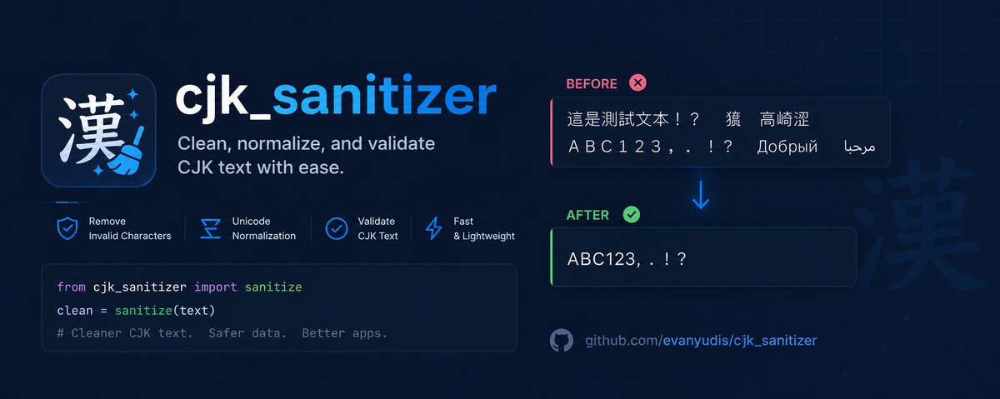

# CJK Sanitizer — Hermes Agent Plugin

<p align="center">
  
</p>

[](LICENSE)
[](https://hermes-agent.nousresearch.com)

**Strip unwanted Chinese (CJK unified ideographs) and Cyrillic characters from LLM output.** Korean Hangul and Japanese Kana are intentionally preserved for legitimate use.

## Why

If you run LLMs from Chinese providers (MiniMax, DeepSeek, GLM, Qwen, etc.), you've seen it: Chinese characters leaking into output mid-sentence, sometimes subtly, sometimes page-long blocks of gibberish. It's a known quirk with models that have significant CJK training data bleed.

This plugin hooks into Hermes Agent's `transform_llm_output` lifecycle and strips those characters silently before they reach your terminal or chat.

## What It Strips

| Script | Range | Stripped? |
|--------|-------|-----------|
| CJK Unified Ideographs (Chinese) | `\u4E00-\u9FFF` | ✅ |
| CJK Extension A | `\u3400-\u4DBF` | ✅ |
| CJK Radicals | `\u2E80-\u2EFF` | ✅ |
| CJK Compatibility Ideographs | `\uF900-\uFAFF` | ✅ |
| Cyrillic (Russian, etc.) | `\u0400-\u04FF` | ✅ |
| Korean Hangul | `\uAC00-\uD7AF` | ❌ Preserved |
| Japanese Hiragana | `\u3040-\u309F` | ❌ Preserved |
| Japanese Katakana | `\u30A0-\u30FF` | ❌ Preserved |

> **Why the name "CJK" then?** The regex targets the CJK unified ideograph block which is shared across Chinese/Japanese/Korean, but the output filtering only strips what looks like a glitch — Chinese characters and Cyrillic. Genuine Korean and Japanese text passes through untouched.

## How It Works

Hermes Agent has a **plugin system** with lifecycle hooks. This plugin registers a `transform_llm_output` hook that runs every time the LLM produces a response:

1. LLM responds → hook fires
2. Regex matches Chinese/Cyrillic character runs
3. Strips them and collapses whitespace
4. If nothing changed, returns `None` (no-op)
5. If something was stripped, returns the cleaned text

The plugin is **context-aware**: if your conversation is in a language that genuinely uses these scripts (e.g., you're learning Chinese), nothing gets stripped.

> **Current behavior:** The `_sanitize` callback always runs. A future update will add prompt-based detection to skip stripping when the user's input contains those scripts.

## Installation

### Prerequisites

- [Hermes Agent](https://hermes-agent.nousresearch.com/docs/getting-started/installation) installed and running

### 1. Install with one command

```bash
hermes plugins install evanyudis/cjk_sanitizer --enable
```

This clones the repo into `~/.hermes/plugins/cjk_sanitizer/` and adds it to your `plugins.enabled` config automatically.

### 2. Restart Hermes Agent

```bash
hermes gateway restart
```

Or start a new CLI session — plugins auto-discover on startup.

### Verify it's loaded

```bash
hermes plugins list
```

You should see `cjk_sanitizer` with a checkmark or "loaded" status.

### Alternative: Manual install

If `hermes plugins install` isn't available (older version), you can do it manually:

```bash
git clone https://github.com/evanyudis/cjk_sanitizer.git ~/.hermes/plugins/cjk_sanitizer
```

Then edit `~/.hermes/config.yaml`:

```yaml
plugins:
  enabled:
    - cjk_sanitizer
```

Then restart.

### Updating

```bash
hermes plugins update cjk_sanitizer
```

## Usage

**There's nothing to configure.** Once the plugin is enabled, it works automatically on every LLM response. Chinese characters and Cyrillic text in model output will be stripped before you see them.

If you need to temporarily disable it without removing it:

```yaml
plugins:
  disabled:
    - cjk_sanitizer
```

(Leave it out of `enabled` and it won't load.)

## What This Fixes

- **MiniMax M2.7** — known to occasionally emit Chinese mid-sentence
- **DeepSeek models** — can drift into Chinese in long reasoning chains
- **GLM / Qwen** — bilingual by nature, sometimes don't switch cleanly
- **Any provider serving China-trained models** — same quirks apply

## What This Does NOT Fix

- Bad translation quality
- Hallucinations
- Language mixing in _your_ prompt (that's a prompting issue)
- Korean or Japanese text leak (those are preserved by design)

## Contributing

Open source is a team sport. Here's how to contribute.

### Getting Started

1. Fork the repo
2. Clone your fork: `git clone https://github.com/<your-username>/cjk_sanitizer.git`
3. Create a branch: `git checkout -b feature/your-feature-name`
4. Make your changes
5. Test with your Hermes Agent setup
6. Push and open a PR

### Development Setup

The plugin lives in a single file (`__init__.py`) — no build step, no dependencies beyond Python stdlib (`re`). To test changes locally:

```bash
# Symlink your dev version
ln -sf /path/to/your/fork ~/.hermes/plugins/cjk_sanitizer

# Restart gateway to pick up changes
hermes gateway restart
```

### Pull Request Guidelines

- **Keep it focused** — one change per PR
- **Update the description** in `plugin.yaml` if your change affects scope
- **Preserve backward compatibility** — don't break existing installs
- **Test edge cases** — empty responses, already-clean text, mixed scripts
- **Use English** in all code, comments, and PR descriptions

### What Needs Help

- **Context-aware detection** — skip stripping when user prompt contains CJK/Cyrillic scripts (language learning use case)
- **Configurable character ranges** — let users specify which scripts to strip via `plugin.yaml`
- **Korean/Japanese opt-in** — add option to strip those too for users who want it
- **Test suite** — even basic pytest cases would help catch regressions
- **More LLM testing** — we've tested with MiniMax and DeepSeek. Reports from other providers welcome.

## Architecture

```
~/.hermes/plugins/cjk_sanitizer/
├── __init__.py      # Plugin logic: regex patterns + hook registration
├── plugin.yaml      # Manifest: name, version, hooks declared
├── README.md        # This file
├── LICENSE          # MIT
└── .gitignore
```

The plugin system is documented in the [Hermes repo](https://github.com/NousResearch/hermes-agent). Plugins go in `~/.hermes/plugins/<name>/`, the manifest is `plugin.yaml`, and the entry point is `__init__.py` with a `register(ctx)` function.

## License

MIT — do what you want, just don't sue me. See [LICENSE](LICENSE).

---

Made by [Evan Yudistira](https://github.com/evanyudis). Not affiliated with Nous Research.
